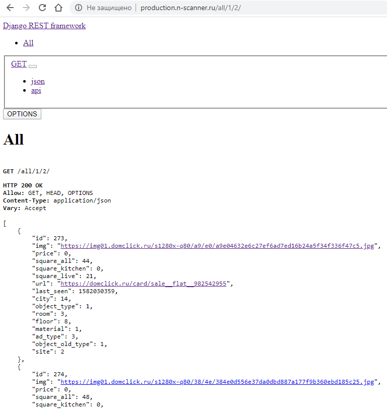

# Parser-Django
Парсер сайтов недвижимости на Python 3.7 + Django.
[example query](http://production.n-scanner.ru/all/1/10/)
# База сайтов
  - n1.ru
  - cian.ru
  - domofond.ru
  - 66.ru
  - domclick.ru
  - etagi.com

# Запуск 
> C:\pint>python main.py
> C:\pint>python manager.py runserver

# Изображение

>Необходим интерпретатор Python версии не ниже, чем 3.6 и Django 2.2

# Библиотеки
>djangorestframework
>django-filter
>beautifulsoup4

